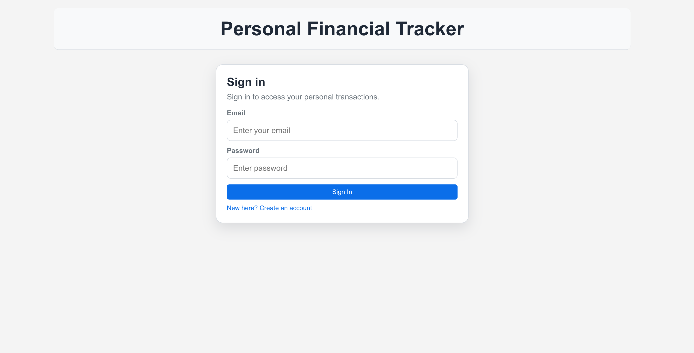
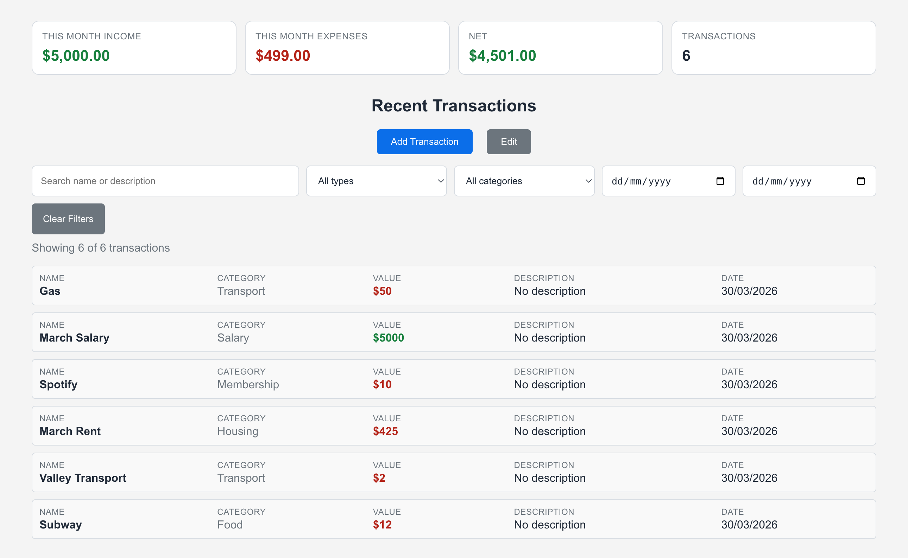
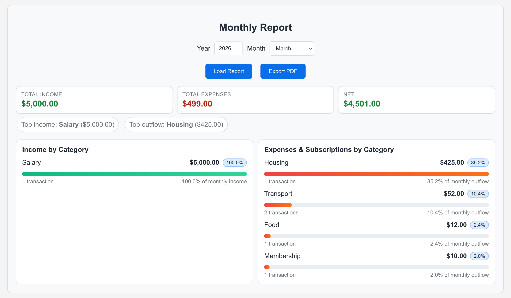
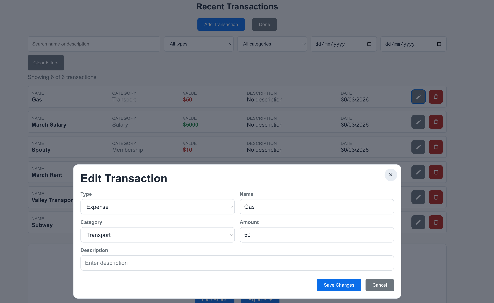
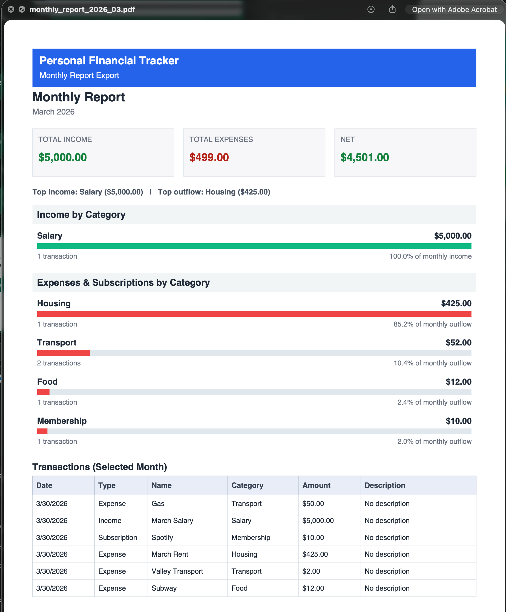

# Personal Financial Tracker

A full-stack personal finance web app to securely track income, expenses, and subscriptions with monthly analytics and PDF reporting.

## Live Project

- Frontend: `https://budget.rishabhdoshi.me`
- Backend API: `https://<your-backend-project>.vercel.app`

## Why This Project

This project demonstrates end-to-end product development: UX-focused frontend work, secure backend architecture, cloud deployment, and production-minded features such as auth, CORS controls, and PDF exports.

## Core Features

- Secure authentication:
  - Signup, login, logout
  - JWT session with HTTP-only cookie support
  - Password hashing using `bcrypt`
- Per-user data isolation:
  - Every transaction is tied to a `userId`
  - Users only read/update/delete their own data
- Transaction management:
  - Add, edit, and delete transactions
  - Fields: `Name`, `Category`, `Type`, `Amount`, `Description`, `Date`
  - Edit mode with icon actions
- Search and filtering:
  - Filter by text, type, category, and date range
- Monthly insights:
  - Summary cards: income, expenses, net, transaction count
  - Breakdown charts for income vs outflow by category
  - Top category insights
- PDF export:
  - Styled report header
  - Summary metrics
  - Category breakdown sections
  - Formatted monthly transactions table with borders and pagination
- UX polish:
  - Responsive layout (desktop/mobile)
  - Dark mode toggle
  - Cleaner modal forms and transaction list presentation

## Screenshots

Add screenshots in this section before sharing with recruiters.

### 1. Auth (Sign in / Sign up)



### 2. Dashboard (Transactions + Filters)



### 3. Monthly Report Section



### 4. Edit Transaction Modal



### 5. PDF Export Preview



## Tech Stack

- Frontend:
  - React (Create React App)
  - CSS
  - jsPDF (PDF export)
- Backend:
  - Node.js
  - Express
  - Mongoose
- Database:
  - MongoDB (Atlas for production)
- Security/Auth:
  - JSON Web Tokens (`jsonwebtoken`)
  - `bcryptjs` password hashing
  - `cookie-parser` for cookie-based sessions
- Deployment:
  - Vercel (frontend + backend)
  - MongoDB Atlas

## Architecture Overview

- Frontend React app calls backend REST API.
- Backend runs as Vercel Node serverless function.
- MongoDB stores users and user-scoped transactions.
- Auth middleware verifies JWT and injects `req.user`.
- All transaction queries are filtered by `req.user.id`.

## API Overview

- Auth:
  - `POST /api/auth/signup`
  - `POST /api/auth/login`
  - `POST /api/auth/logout`
  - `GET /api/auth/me`
- Transactions:
  - `GET /api/transactions`
  - `POST /api/transactions`
  - `PUT /api/transactions/:id`
  - `DELETE /api/transactions/:id`
  - `GET /api/transactions/report/:year/:month`

## Local Development Setup

1. Clone the repository:
   ```bash
   git clone <your-repo-url>
   cd Rishabh-finance-tracker
   ```
2. Install backend dependencies:
   ```bash
   npm install
   ```
3. Install frontend dependencies:
   ```bash
   cd finance-tracker-frontend
   npm install
   cd ..
   ```
4. Create backend `.env` in project root:
   ```env
   MONGO_URI=mongodb://127.0.0.1:27017/finance-tracker
   PORT=5001
   JWT_SECRET=replace-with-a-long-random-secret
   ALLOWED_ORIGINS=http://localhost:3000
   ALLOW_VERCEL_PREVIEWS=false
   ```
5. Create frontend `.env` in `finance-tracker-frontend`:
   ```env
   REACT_APP_API_BASE_URL=http://localhost:5001
   ```
6. Start MongoDB locally (`mongod` running).
7. Start backend:
   ```bash
   node server.js
   ```
8. Start frontend (new terminal):
   ```bash
   cd finance-tracker-frontend
   npm start
   ```
9. Open `http://localhost:3000`, create an account, and sign in.

## Production Deployment (Vercel + Atlas)

### Backend Environment Variables

```env
MONGO_URI=mongodb+srv://<user>:<password>@<cluster-url>/finance-tracker?retryWrites=true&w=majority
JWT_SECRET=<long-random-secret>
ALLOWED_ORIGINS=https://budget.rishabhdoshi.me
ALLOW_VERCEL_PREVIEWS=true
```

### Frontend Environment Variables

```env
REACT_APP_API_BASE_URL=https://<your-backend-project>.vercel.app
```

### Deployment Flow

1. Create Atlas cluster + DB user.
2. Add Atlas network access (`0.0.0.0/0` for quick-launch setup).
3. Deploy backend project from repo root (`/`) in Vercel.
4. Deploy frontend project from `finance-tracker-frontend` in Vercel.
5. Add custom domain `budget.rishabhdoshi.me` to frontend Vercel project.
6. Update backend `ALLOWED_ORIGINS` to `https://budget.rishabhdoshi.me`.
7. Push to `main` for automatic deploys.

## Security Notes

- Passwords are hashed (not stored in plaintext).
- JWT secret is stored server-side only (never in frontend code).
- CORS is allowlist-based via `ALLOWED_ORIGINS`.
- HTTP-only cookie session support is enabled for safer token handling.
